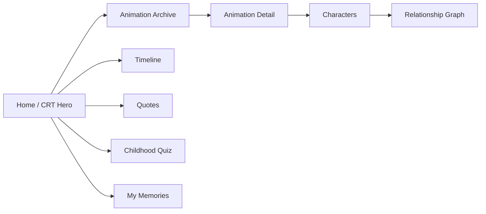

<div align="center">


# Digital Childhood Museum

**A digital museum for Chinese animation memories from the 90s and 00s generation.**

[English](./README.md) | [简体中文](./README.zh-CN.md)

[](https://museum.seanwalter.top)
[](https://nextjs.org)
[](https://react.dev)
[](./LICENSE)

</div>

---

## What it is

A nostalgic web experience built around classic Chinese animation.

It is **not a video streaming site**. The project focuses on memory, discovery and interaction:

- CRT-inspired visual design
- animation archive and filters
- timeline browsing
- character relationship graph
- quote walls
- childhood quiz
- local memory notebook
- shareable memory cards

**Live:** https://museum.seanwalter.top

---

## Quick Start

```bash
git clone https://github.com/Dream22180971/animation-memory-museum.git
cd animation-memory-museum

npm install
npm run dev
```

Open `http://localhost:3000`.

Quality commands:

```bash
npm run validate:data
npm run typecheck
npm run lint
npm run test:e2e
npm run build
```

---

## Experience Map



---

## Highlights

| Area | Experience |
|---|---|
| CRT visual system | scanlines, glow and retro TV atmosphere |
| Archive | browse by era, genre and source |
| Character graph | explore relationships visually |
| Quiz | lightweight nostalgia interaction |
| Memory notebook | store personal memories locally |
| Share card | turn a memory into a shareable image |
| Data validation | schema validation before production build |
| E2E | Playwright coverage for desktop and mobile |

---

## Data & Copyright Position

The project does not host animation video files.

Archive metadata is curated from public information, while personal memory entries remain local to the user's browser.

---

## Build Note

The production build intentionally uses:

```bash
npm run build
```

The script currently runs Next.js with webpack after data validation. Keep this behavior unless bundle behavior has been re-tested.

---

## Roadmap

- [x] CRT home experience
- [x] archive and search
- [x] character graph
- [x] childhood quiz
- [x] local memory notebook
- [x] share cards
- [ ] more animation categories
- [ ] childhood TV / Flash-game collections
- [ ] richer memory storytelling
- [ ] AI-assisted nostalgia interactions

---

## License

[MIT](./LICENSE)

<div align="center">

**Not a streaming site. A place for the memories around the screen.**

</div>
