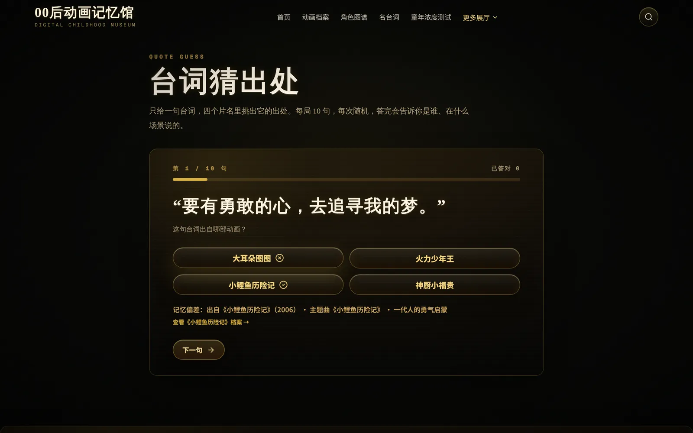
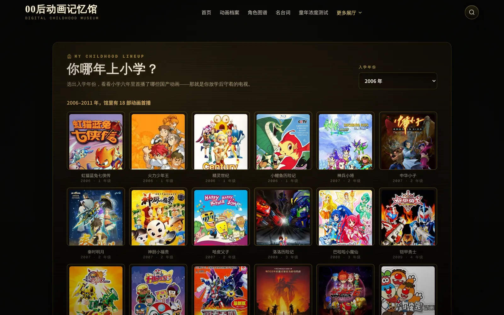
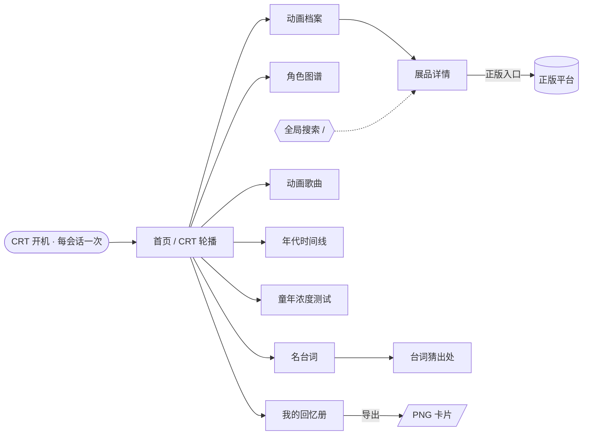

<div align="center">

# 00后动画记忆馆

**为 90 后、00 后保存国产动画童年记忆的数字博物馆 —— 放学后的 17:30，是我们等了很久的动画时间。**

[简体中文](./README.md) | [English](./README.en.md)

[](https://museum.seanwalter.top)
[](https://nextjs.org)
[](https://react.dev)
[](./LICENSE)
[](https://github.com/Dream22180971/animation-memory-museum/actions/workflows/ci.yml)


**[进入记忆馆 →](https://museum.seanwalter.top)** · [快速开始](#-快速开始)

</div>

---

## 🎯 它是什么

这是一间放在网上的国产动画记忆馆：猪猪侠、虹猫蓝兔七侠传、超兽武装、秦时明月……那些陪一代人长大的电视动画，被整理成一间可以慢慢逛的展厅。

它 **不是视频站**，不存任何视频和音频。这里收藏的是屏幕之外的东西：海报、角色、口头禅、主题曲、首播的那一年，还有一本只属于你自己的回忆册。所有"观看"按钮都只会把你带去正版平台。

## 📺 今晚节目单

整个网站按电视频道来排布，每一行都对应 `src/app/` 里真实存在的路由。

| 频道 | 路由 | 正在播出 |
|---|---|---|
| **CH 01** · 首页 | `/` | CRT 电视轮播 6 部核心作品（桌面端按数字键 1–6 或拧面板旋钮就能换台）、胶片条、各展厅预览 |
| **CH 02** · 动画档案 | `/archive` | 全部馆藏，支持关键词搜索、类型 / 年份筛选与排序 |
| **CH 03** · 展品详情 | `/archive/[slug]` | 海报、制作方、首播平台、角色、正版观看入口、分享与"我也看过" |
| **CH 04** · 角色图谱 | `/characters` | 可交互的角色关系图：拖拽、平移、缩放，点击角色看人物档案 |
| **CH 05** · 名台词 | `/quotes` | 口头禅、登场句和燃点台词，按作品筛选 |
| **CH 06** · 动画歌曲 | `/songs` | 磁带样式的片头曲 / 片尾曲，点一首去 B 站搜来听 |
| **CH 07** · 年代时间线 | `/timeline` | 选出你哪年上小学，列出小学六年里首播的作品；下面是从最早馆藏年份起每 4 年一段的时间线 |
| **CH 08** · 童年浓度测试 | `/quiz` | 六道题测出你的童年浓度，结果可以存成图片卡 |
| **CH 09** · 台词猜出处 | `/guess` | 随机 10 句名台词，四选一猜出自哪部，答完揭晓说话人和场景 |
| **CH 10** · 我的回忆册 | `/#contribute` | 只存在本机浏览器里的回忆册，可导出 PNG 卡片，也能备份和恢复 |
| **CH 11** · 关于我们 | `/about` | 项目故事、版权声明与致谢 |

桌面端导航里的「更多展厅」可以直达时间线、台词猜出处、歌曲、回忆册和关于页。任意页面按 <kbd>/</kbd> 都能打开全局搜索，可以搜动画、歌曲、歌手和题材。

## 🎬 页面截图

以下截图均由 [`scripts/capture-screenshots.mjs`](./scripts/capture-screenshots.mjs) 在本地生产构建上截取。

<table>
  <tr>
    <td width="50%"><br /><sub><b>动画档案</b>：搜索、筛选、排序全部馆藏</sub></td>
    <td width="50%"><br /><sub><b>展品详情</b>：元数据、角色与正版入口</sub></td>
  </tr>
  <tr>
    <td><br /><sub><b>角色图谱</b>：可拖拽、可缩放的人物关系</sub></td>
    <td><br /><sub><b>名台词</b>：按作品归档的经典台词</sub></td>
  </tr>
  <tr>
    <td><br /><sub><b>动画歌曲</b>：一盘盘倒带重听的磁带</sub></td>
    <td><br /><sub><b>我的回忆册</b>：只存本机，可导出卡片</sub></td>
  </tr>
  <tr>
    <td><br /><sub><b>台词猜出处</b>：一句台词，四选一</sub></td>
    <td><br /><sub><b>你哪年上小学</b>：小学六年的童年片单</sub></td>
  </tr>
  <tr>
    <td><br /><sub><b>童年浓度测试</b>：六道题，一个可以晒的结果</sub></td>
    <td align="center"><br /><sub><b>移动端</b>：同一个傍晚，搬到手机上</sub></td>
  </tr>
</table>

## ✨ 核心功能

| 区域 | 体验 |
|---|---|
| CRT 开机仪式 | 首页每个会话只播一次的老电视开机动画；系统开启"减少动态效果"时自动跳过 |
| 馆藏规模 | 35 部作品（1999–2018）、160 位角色、155 条角色关系、112 句台词、42 首歌曲 |
| 正版观看入口 | 127 个外链，直接打开作品在腾讯视频、哔哩哔哩、爱奇艺、优酷、央视频、西瓜视频上的搜索页，站内不播放任何内容 |
| 角色图谱 | 每部作品一张关系图，支持拖拽、平移、缩放、关系标签和人物档案 |
| 我的回忆册 | 回忆写在自己的浏览器里（保留最新 20 条），任意一条都能用 canvas 画成 PNG 卡片导出；整本册子可以备份成 JSON，换设备后再恢复（自动去重） |
| 真的能换台 | 首页电视在视口里时按数字键 1–6 直接换台；面板三个旋钮依次是上一台、随机换台、下一台；焦点在电视里时方向键也能换台；换台会播报给读屏软件 |
| 台词猜出处 | 每局从馆藏台词里随机抽 10 句、每句来自不同作品，台词里直接带出片名的不出题；答完一题就揭晓出处、说话人和场景 |
| 童年片单 | 时间线页选出入学年份，列出小学六年首播的作品；链接带 `?entry=` 参数，可以直接发给同届同学 |
| 结果卡片 | 童年浓度测试、台词猜出处的成绩和童年片单都可以生成 1200×630 的图片卡，手机上直接调起分享，桌面端下载 |
| 我也看过 | 每个展品一键标记，记在本机 |
| 分享预览 | 每个展厅都有自己的分享标题和预览图（截自真实页面），展品详情页用该作品的海报 |
| 分享 | 支持系统分享面板的设备直接调起，其他情况复制到剪贴板 |
| 动效系统 | 动效 token 与仪式规范见 [`Museum-Motion-Design-System-v1.0.md`](./Museum-Motion-Design-System-v1.0.md) |

## 🧭 体验地图


```mermaid
flowchart LR
    Boot([CRT 开机 · 每会话一次]) --> Home[首页 / CRT 轮播]
    Home --> Archive[动画档案]
    Archive --> Exhibit[展品详情]
    Exhibit -->|正版入口| Platform[(正版平台)]
    Home --> Characters[角色图谱]
    Home --> Quotes[名台词]
    Home --> Songs[动画歌曲]
    Home --> Timeline[年代时间线]
    Home --> Quiz[童年浓度测试]
    Quotes --> Guess[台词猜出处]
    Home --> Memory[我的回忆册]
    Memory -->|导出| Card[/PNG 卡片/]
    Search{{全局搜索  /}} -.-> Exhibit
```

## 🔐 隐私与内容边界

- **回忆只留在你的设备上。** 回忆册和"我也看过"的标记都存在浏览器 `localStorage` 里，不会上传；备份文件也只下载到你自己的设备。想让某段回忆进入公开馆藏，可以[提 Issue](https://github.com/Dream22180971/animation-memory-museum/issues)。
- **线上站点接入了 Vercel Web Analytics**（`@vercel/analytics`），用于统计页面访问。
- **不托管任何视频或音频。** 观看按钮和歌曲链接都会离开本站，跳到正版平台或 B 站搜索。
- **来源可查。** 资料考据参考百度百科等公开来源（每部作品都附链接）；海报收集自 [Bangumi](https://bgm.tv) 等社区数据库，记录在 [`scripts/poster-credits.json`](./scripts/poster-credits.json)。所有素材版权归原作者及出品方所有，权利人可通过 GitHub Issue 申请下架，详见 `/about` 页。

## 🔎 搜索与 AI 收录

网站为搜索引擎和 AI 搜索准备了这些入口，全部由 `animations.json` 自动生成，新增馆藏无需手动维护：

| 入口 | 内容 |
|---|---|
| [`/sitemap.xml`](https://museum.seanwalter.top/sitemap.xml) | 首页、8 个展厅和全部展品详情页 |
| [`/robots.txt`](https://museum.seanwalter.top/robots.txt) | 放行所有爬虫，并单独列出 GPTBot、ClaudeBot、PerplexityBot 等 AI 爬虫 |
| [`/llms.txt`](https://museum.seanwalter.top/llms.txt) | 给 AI 读的站点导读：展厅说明和每部作品的年份、制作方、首播平台、类型与角色 |
| JSON-LD 结构化数据 | 首页 `WebSite`、档案页 `ItemList`、每部作品 `TVSeries`（含角色、制作方、百科链接）和面包屑 |
| 页面元数据 | 每个页面独立的标题、描述、canonical 和分享预览图 |

所有页面都在构建时预渲染，台词、角色、歌曲等文字直接写在 HTML 里，不执行 JavaScript 的爬虫也能读到。

**需要站长自己完成的一步：** 在各平台验证网站所有权并提交站点地图。网站已预留验证标签，在部署环境（如 Vercel）里设置对应变量后重新部署即可：

| 平台 | 环境变量 | 生成的标签 |
|---|---|---|
| Google Search Console | `GOOGLE_SITE_VERIFICATION` | `google-site-verification` |
| Bing Webmaster Tools | `BING_SITE_VERIFICATION` | `msvalidate.01` |
| 百度搜索资源平台 | `BAIDU_SITE_VERIFICATION` | `baidu-site-verification` |

没设置的变量不会输出任何标签。

## ⚡ 快速开始

需要 **Node.js 22**（与 CI 一致）和 npm。

```bash
git clone https://github.com/Dream22180971/animation-memory-museum.git
cd animation-memory-museum

npm install
npm run dev
```

打开 `http://localhost:3000`。

## 🛠 常用命令

| 命令 | 作用 |
|---|---|
| `npm run dev` | 启动开发服务器 |
| `npm run validate:data` | 按 `scripts/validate-data.mjs` 中的规则校验 `src/data/animations.json` |
| `npm run typecheck` | `tsc --noEmit` |
| `npm run lint` | ESLint |
| `npm run build` | 先跑 `validate:data`（`prebuild`），再执行 `next build --webpack` |
| `npm start` | 启动生产构建 |
| `npm run test:e2e` | Playwright 端到端测试 |
| `node scripts/capture-screenshots.mjs` | 对运行中的站点重新生成 `docs/screenshots/`（可用 `BASE_URL` 指定地址，默认 `http://localhost:3000`） |
| `node scripts/capture-og-images.mjs` | 对运行中的站点重新截取各展厅的分享预览图 `src/app/**/opengraph-image.jpg`，之后需要重新构建；两个截图脚本都可以用 `ONLY=guess,timeline` 只重拍指定页面 |

生产构建刻意使用 webpack（`next build --webpack`）。除非重新验证过 Bundle 行为，否则请保持不变。

## 🧪 测试

`tests/e2e/museum.spec.ts` 覆盖：首页统计与全局搜索、档案筛选、回忆册（保存、导出入口、删除、备份与恢复，且不会混进公开档案）、"我也看过"、童年浓度测试与结果卡片、台词猜出处（十题流程、揭晓出处、成绩卡片）、入学年份童年片单、首页电视换台（数字键、旋钮、方向键，打字时不抢键）、展品元数据与正版入口、角色图谱（切换作品、打开人物档案、拖拽与缩放），以及站点地图、robots、`llms.txt`、结构化数据和分享元数据。

- Playwright 会自己在 `127.0.0.1:3100` 启动开发服务器，分别跑 **桌面 Chrome** 和 **Pixel 5** 两个项目。
- 本地默认使用你已安装的 Google Chrome（`channel: "chrome"`）；设置了 `CI` 环境变量时改用 Playwright 自带的 Chromium（需先 `npx playwright install chromium`）。
- [CI](./.github/workflows/ci.yml) 在每个 Pull Request 和推送到 `main` 时依次执行：lint → 数据校验 → 类型检查 → 构建 → E2E。

## 🗂 项目结构

```text
src/
├── app/                 # 路由：/、archive、archive/[slug]、characters、quotes、songs、timeline、quiz、guess、about，
│                        # 以及 sitemap.ts、robots.ts、llms.txt/ 和各展厅的 opengraph-image.jpg
├── components/          # hero（CRT、开机动画、胶片条）、archive、characters、quotes、songs、timeline、
│                        # quiz、search、engagement（回忆册）、motion、layout、ui
├── data/animations.json # 全部馆藏，唯一数据源
└── lib/                 # 数据工具、测试逻辑、站点常量（HERO_FEATURED_SLUGS 等）、页面元数据、结构化数据、
                         # 分享卡片绘制、回忆册备份
scripts/                 # 数据校验、海报抓取与压缩、截图
tests/e2e/               # Playwright 用例
public/images/           # 海报、场景与回忆插图
```

### 新增一部馆藏

1. 在 `src/data/animations.json` 里加一条记录（`scripts/validate-data.mjs` 列出的字段都是必填）。
2. 运行 `npm run validate:data`。
3. 想让它出现在首页电视里，需要手动把 slug 加进 `src/lib/constants.ts` 的 `HERO_FEATURED_SLUGS`，新馆藏不会自动进轮播。

## ⚠️ 当前限制

- 界面只有中文。
- 馆藏为人工整理：目前 35 部，年份跨度 1999–2018，只收录国产电视动画。
- 回忆册按浏览器保存：没有账号、不会自动同步，只保留最新 20 条；清除站点数据前请先用「备份回忆册」导出。
- 不提供播放，这是刻意的设计：记忆馆只负责把你指向正版平台。

## 🗺 路线图

- [x] CRT 首页与开机仪式
- [x] 动画档案、展品详情与全局搜索
- [x] 角色关系图谱
- [x] 名台词、动画歌曲与年代时间线
- [x] 童年浓度测试
- [x] 台词猜出处、入学年份童年片单与能换台的首页电视
- [x] 本地回忆册与卡片导出
- [ ] 更多作品与动画类别
- [ ] 童年电视剧、Flash 游戏与老互联网记忆专题
- [ ] AI 怀旧互动

## 🤝 参与贡献

欢迎通过 [GitHub Issues](https://github.com/Dream22180971/animation-memory-museum/issues) 推荐作品、纠正资料，或提交值得入馆的回忆。提交代码前请先跑一遍 `npm run lint`、`npm run typecheck` 和 `npm run build`。

## 📄 License

代码以 [MIT License](./LICENSE) 开源。动画名称、海报、角色、台词与歌曲等素材的版权归原作者及出品方所有。

<div align="center">

**不是为了重播动画，而是为了保存屏幕之外的那段童年。**

</div>
