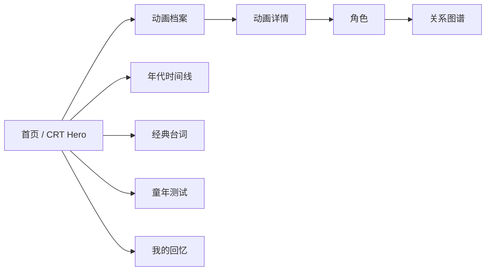

<div align="center">


# 00 后动画记忆馆

**为 90/00 后保存国产动画童年记忆的数字博物馆。**

[English](./README.md) | [简体中文](./README.zh-CN.md)

[](https://museum.seanwalter.top)
[](https://nextjs.org)
[](https://react.dev)
[](./LICENSE)

</div>

---

## 🎯 它是什么

一个围绕国产动画童年记忆做的沉浸式网站。

它 **不是视频站**，重点是“记忆”和“探索”：

- CRT 老电视视觉
- 动画档案与筛选
- 年代时间线
- 角色关系图谱
- 经典台词
- 童年浓度测试
- 本地回忆册
- 可分享记忆卡

**在线体验：** https://museum.seanwalter.top

---

## ⚡ 5 分钟快速开始

```bash
git clone https://github.com/Dream22180971/animation-memory-museum.git
cd animation-memory-museum

npm install
npm run dev
```

访问 `http://localhost:3000`。

质量检查：

```bash
npm run validate:data
npm run typecheck
npm run lint
npm run test:e2e
npm run build
```

---

## 🧭 体验地图



---

## ✨ 核心亮点

| 区域 | 体验 |
|---|---|
| CRT 视觉系统 | 扫描线、辉光、老电视氛围 |
| 档案馆 | 按年代、题材和来源筛选 |
| 角色图谱 | 用可视化方式探索人物关系 |
| 测试 | 轻量童年互动 |
| 回忆册 | 把个人回忆存在本地 |
| 分享卡 | 把回忆导出成图片 |
| 数据校验 | 构建前做 Schema 校验 |
| E2E | Playwright 覆盖桌面与移动端 |

---

## 📚 数据与内容边界

项目不托管动画视频资源。

馆藏元数据来自公开资料整理；用户自己写的回忆默认只保存在浏览器本地。

---

## 🛠 构建说明

生产构建使用：

```bash
npm run build
```

当前脚本会先校验数据，再使用 Next.js webpack 构建。除非重新验证 Bundle 行为，否则不要随意移除这部分配置。

---

## 🗺 路线图

- [x] CRT 首页体验
- [x] 档案与搜索
- [x] 角色关系图
- [x] 童年测试
- [x] 本地回忆册
- [x] 分享卡
- [ ] 更多动画类别
- [ ] 童年电视剧 / Flash 游戏专题
- [ ] 更丰富的回忆叙事
- [ ] AI 怀旧互动

---

## 📄 License

[MIT](./LICENSE)

<div align="center">

**不是为了重播动画，而是为了保存屏幕之外的那段童年。**

</div>
